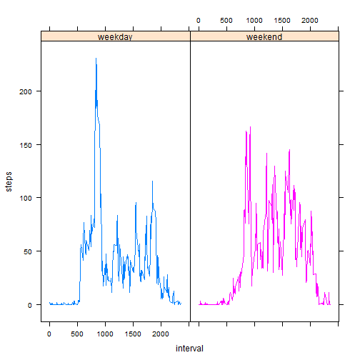

#Reproducible Research: Peer Assessment 1
##Loading and preprocessing the data


```r
unzip("getdata_dataset.zip", files = NULL, list = FALSE, overwrite = TRUE,
      junkpaths = FALSE, exdir = ".", unzip = "internal",
      setTimes = FALSE)
data <- read.csv("activity.csv", header=TRUE)
```


## What is mean total number of steps taken per day?
## Make a histogram of the total number of steps taken each day.

```r
hist(tapply(data$steps, data$date, sum,na.rm=TRUE), breaks=20, 
     xlab= "sum of steps taken per day", main= "histogram")
```

 

## Calculate and report the mean and median total number of steps taken per day

```r
mean(tapply(data$steps, data$date, sum,na.rm=TRUE))
```

```
## [1] 9354.23
```

```r
median(tapply(data$steps, data$date, sum,na.rm=TRUE))
```

```
## [1] 10395
```

## What is the average daily activity pattern?
## Make a time series plot 

```r
plot(tapply(data$steps, data$interval, mean, na.rm=TRUE),type = "l", xlab = "interval", ylab="mean of steps")
```

 

## Which 5-minute interval, on average across all the days in the dataset, 
## contains the maximum number of steps?


```r
which.max(tapply(data$steps, data$interval, mean, na.rm=TRUE))
```

```
## 835 
## 104
```

# Imputing missing values
##Calculate and report the total number of missing values in the dataset


```r
nrow(data[is.na(data$steps),])
```

```
## [1] 2304
```

##Devise a strategy for filling in all of the missing values in the dataset.
##Imputation using mean of that 5-minute interval.


```r
complete <- data
average <- aggregate(x = list(steps = data$steps), by = list(interval = data$interval),FUN = mean, na.rm = TRUE)
for( i in 1:nrow(complete)){
  ifelse(is.na(complete[i,1]), 
         complete[i,1] <- average[average$interval==complete[i,3],2],
         complete[i,1] <- complete[i,1])}
```

## Make a histogram of the total number of steps taken each day 


```r
hist(tapply(complete$steps, complete$date, sum, na.rm=TRUE), breaks = 20,
     xlab= "sum of steps taken per day", main= "histogram")
```

 

## Calculate and report the mean and median total number of steps taken per day


```r
mean(tapply(complete$steps, complete$date, sum, na.rm=TRUE))
```

```
## [1] 10766.19
```

```r
median(tapply(complete$steps, complete$date, sum, na.rm=TRUE))
```

```
## [1] 10766.19
```

##  Do these values differ from the estimates from the first part of the assignment?what is the impact of imputing missing data on the estimates of the total daily number of steps?

Answer:Mean and Median is higher in data with imputation. 
Because there are some day which have only missig data, these days`s frequency are 0.

## Are there differences in activity patterns between weekdays and weekends?


```r
library(chron)
Sys.setlocale("LC_TIME","C")
```

```
## [1] "C"
```

```r
complete$date <- as.Date(as.character(complete$date))
complete$week <- ifelse(weekdays(complete$date)=="Sunday"|weekdays(complete$date)=="Saturday", complete$week <- "weekend", complete$week <- "weekday")
```

I will make plots to  compare  two groups.


```r
library(lattice)
average <- aggregate(steps~interval+week,data=complete,mean,na.rm=TRUE)
xyplot (steps ~ interval |week, data = average, type="l", groups = week)
```

 

